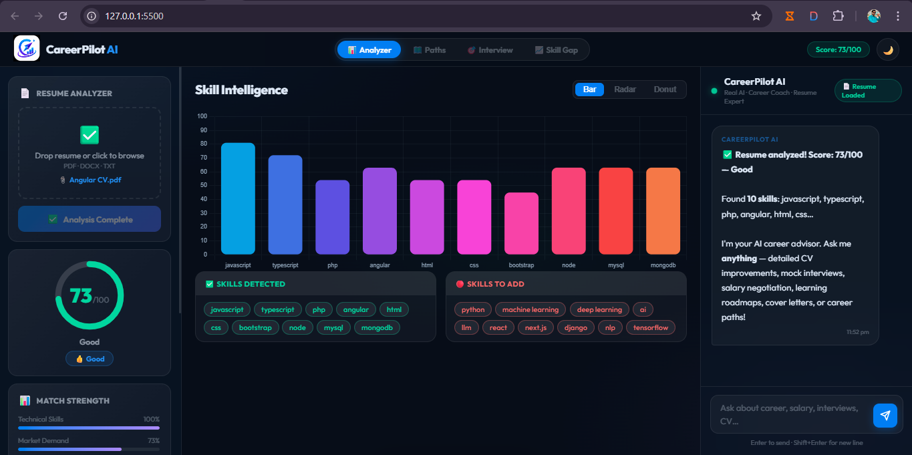

# 🚀 CareerPilot AI — Career Intelligence Platform

> An AI-powered career assistant that analyzes resumes, identifies skill gaps, prepares you for interviews, and provides personalized career roadmaps.



---

## ✨ Features

| Feature | Description |
|---|---|
| 📊 **Resume Analyzer** | Upload PDF/DOCX/TXT — get a score out of 100 with detailed breakdown |
| 🧠 **Skill Intelligence** | Bar, Radar, and Donut charts showing your skill profile |
| 🗺️ **Career Paths** | Personalized role recommendations with Pakistan + remote salaries |
| 📈 **Skill Gap Roadmap** | Step-by-step learning plan with timelines |
| 🎯 **Interview Prep** | Technical, behavioral, and system design questions for your stack |
| 💬 **AI Chat Coach** | Powered by Claude AI — answers any career question |

---

## 🖥️ Tech Stack

**Frontend**
- Vanilla JavaScript (ES6+)
- Chart.js 4.4 — skill visualizations
- Custom CSS with dark/light theme

**Backend**
- Python 3.x + Flask
- Anthropic Claude API (`claude-sonnet-4-20250514`)
- PyMuPDF / python-docx — resume parsing

---

## ⚡ Quick Start

### 1. Clone the repository
```bash
git clone https://github.com/Uzair686/careerpilot-ai
cd careerpilot-ai
```

### 2. Create virtual environment
```bash
python -m venv venv

# Windows
venv\Scripts\activate

# Mac/Linux
source venv/bin/activate
```

### 3. Install dependencies
```bash
pip install -r requirements.txt
```

### 4. Set your Anthropic API key

Create a `.env` file in the root folder:
```
ANTHROPIC_API_KEY=sk-ant-your-key-here
```

> 🔑 Get a free API key at [console.anthropic.com](https://console.anthropic.com)

### 5. Run the app
```bash
python backend/app.py
```

Open your browser at: **http://localhost:5000**

---

## 📁 Project Structure

```
careerpilot-ai/
│
├── backend/
│   ├── app.py              # Flask server + /api/chat route
│   ├── chatbot.py          # Claude AI integration
│   ├── resume_parser.py    # PDF/DOCX text extraction
│   ├── report_generator.py # PDF report generation
│   └── utils.py            # Helper functions
│
├── frontend/
│   ├── script.js           # All frontend logic + AI chat
│   └── style.css           # Dark/light theme styles
│
├── index.html              # Main app entry point
├── requirements.txt
├── .gitignore
└── README.md
```

---

## 🔐 Environment Variables

| Variable | Description | Required |
|---|---|---|
| `ANTHROPIC_API_KEY` | Your Anthropic Claude API key | Yes (for AI chat) |
| `PORT` | Server port (default: 5000) | No |
| `FLASK_DEBUG` | Enable debug mode (`true`/`false`) | No |

---

## 📊 Resume Scoring System

Scores are calculated across 5 factors:

| Factor | Max Points | What it measures |
|---|---|---|
| Skill Breadth | 45 | Number and variety of skills (with diminishing returns) |
| Skill Quality | 20 | High-value skills (AI, cloud, senior frameworks) |
| Profile Completeness | 20 | Email, phone, LinkedIn, GitHub present |
| Resume Depth | 10 | Word count and content length |
| Content Quality | 5 | Quantified achievements, certifications, leadership |

---

## 🌐 Deployment

### Deploy on Render (Free)
1. Push to GitHub
2. Go to [render.com](https://render.com) → New Web Service
3. Connect your GitHub repo
4. Set environment variable: `ANTHROPIC_API_KEY`
5. Build command: `pip install -r requirements.txt`
6. Start command: `python backend/app.py`

### Deploy on Railway
```bash
railway login
railway init
railway up
```
Set `ANTHROPIC_API_KEY` in Railway dashboard environment variables.

---

## 🤝 Contributing

1. Fork the repo
2. Create a feature branch: `git checkout -b feature/amazing-feature`
3. Commit your changes: `git commit -m 'Add amazing feature'`
4. Push to branch: `git push origin feature/amazing-feature`
5. Open a Pull Request

---

## 👨‍💻 Author

**Muhammad Uzair**
- GitHub: [Uzair686](https://github.com/Uzair686)
- LinkedIn: [Muhammad Uzair Shahid](https://www.linkedin.com/in/muhammad-uzair-shahid-09b947305/)

---

## 📄 License

This project is licensed under the MIT License — see the [LICENSE](LICENSE) file for details.

---

<div align="center">
  <strong>⭐ Star this repo if it helped you land your dream job!</strong>
</div>